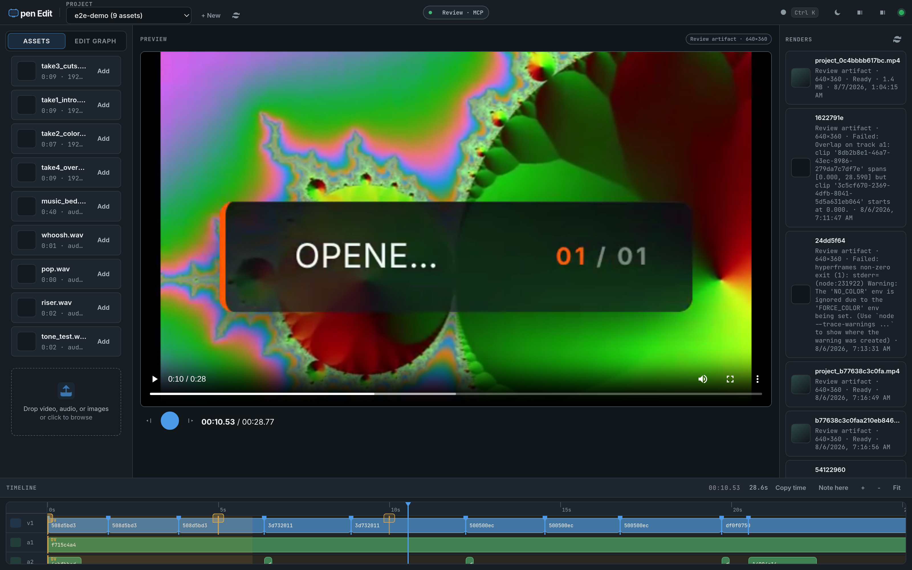
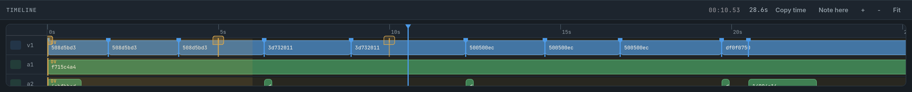

# Open Edit


**AI-native video editing, driven over MCP.**


*The Review Studio, live: preview a cut, inspect renders, and scrub the edit graph.*


*The timeline: clips on V1/A1/A2, edit markers, and a playhead that is ready to scrub.*

<video controls loop muted playsinline poster="docs/intro-poster.jpg" width="640">
  <source src="docs/intro-highlight.mp4" type="video/mp4">
  <a href="docs/intro-demo.gif">Open Edit logo intro (animated GIF)</a>
</video>
*The 60-second logo intro — animated in HTML/CSS with the HyperFrames engine and rendered entirely through Open Edit's own pipeline (the agent built the project, added the overlay, and ran the final 1080p30 GPU export).*

## What it is

Open Edit is an AI-native video editor that runs as a **local MCP server** over stdio.
An external agent (Cursor, Claude Code, OpenCode, any MCP client) owns the creative loop;
Open Edit owns the machinery: SHA-256 content-addressed ingest, word-level transcription
(faster-whisper), an append-only IR edit graph in SQLite (WAL), and melt + ffmpeg rendering
with a 640×360 proxy review artifact and a 1080p final export.

No cloud, no built-in LLM. The server is pinned to one project directory and executes
28 kinds of IR edit operations against it, each one recorded, reversible, and renderable.

## Downloads

**Python package (pip):**

```bash
pip install open-edit      # installs the open-edit CLI + open-edit-mcp server
```

**Linux / macOS — one command (full render stack):**

```bash
curl -fsSL https://github.com/AH64-dll/OpenEdit/releases/download/v1.3.1/install.sh | bash
```

**Windows (PowerShell):**

```powershell
irm https://github.com/AH64-dll/OpenEdit/releases/download/v1.3.1/install.ps1 | iex
```

**Source (v1.3.1):** [zip](https://github.com/AH64-dll/OpenEdit/archive/refs/tags/v1.3.1.zip) · [tar.gz](https://github.com/AH64-dll/OpenEdit/archive/refs/tags/v1.3.1.tar.gz)

Both installers also provision the render runtime (Node.js + the bundled HyperFrames overlay engine, plus ffmpeg/melt/Chrome checks) and print a readiness summary — see [INSTALL.md → Runtime requirements](INSTALL.md#runtime-requirements).

## The agent way

Open Edit is built to be operated by an agent, not a GUI. Paste the install prompt into
your agent and it will clone, install, verify end to end, and report back. Then paste the
configure prompt to register the MCP server in your host and confirm all six tools appear.

- [docs/agent-install.md](docs/agent-install.md) — agent-driven install prompt
- [docs/agent-configure.md](docs/agent-configure.md) — agent-driven MCP configuration

## The normal way

**Linux / macOS**

```bash
git clone https://github.com/AH64-dll/OpenEdit.git
cd OpenEdit
python3 -m venv .venv
source .venv/bin/activate
pip install -U pip
pip install -e ".[mcp]"        # extras: ,serve (review UI) · ,whisper (transcription)
```

**Windows (PowerShell)**

```powershell
git clone https://github.com/AH64-dll/OpenEdit.git C:\OpenEdit
cd C:\OpenEdit
python -m venv .venv
.\.venv\Scripts\Activate.ps1   # if blocked: Set-ExecutionPolicy -Scope CurrentUser RemoteSigned
python -m pip install -U pip
pip install -e ".[mcp]"
```

Check the entry point, create a project, and start the review studio:

```bash
.venv/bin/open-edit-mcp --help            # Windows: .\.venv\Scripts\open-edit-mcp.exe --help
mkdir -p ~/OpenEditProjects               # Windows: New-Item -ItemType Directory -Force -Path "$env:USERPROFILE\OpenEditProjects"
open_edit init ~/OpenEditProjects/my-talk
open_edit serve --review-only --port 8000 # → http://127.0.0.1:8000 (needs the ,serve extra)
```

Register the server in Cursor (`~/.cursor/mcp.json` on Linux/macOS, `%USERPROFILE%\.cursor\mcp.json` on Windows) and reload MCP:

```json
// Linux / macOS
{
  "mcpServers": {
    "open-edit": {
      "command": "/ABSOLUTE/PATH/TO/OpenEdit/.venv/bin/open-edit-mcp",
      "args": ["--project", "/home/YOU/OpenEditProjects/my-talk"],
      "env": { "OPEN_EDIT_RENDER_BACKEND": "cpu" }
    }
  }
}

// Windows
{
  "mcpServers": {
    "open-edit": {
      "command": "C:\\OpenEdit\\.venv\\Scripts\\open-edit-mcp.exe",
      "args": ["--project", "C:\\Users\\YOU\\OpenEditProjects\\my-talk"],
      "env": { "OPEN_EDIT_RENDER_BACKEND": "cpu" }
    }
  }
}
```

## What you get

| Tool | Role |
|---|---|
| `query_project` | Read-only project queries |
| `edit_project` | Mutations + creative generation |
| `run_script` | Free-form Python IR edits (bwrap sandbox on Linux, `dev` on Windows) |
| `trigger_render` | Enqueue proxy / final / preview-chunks renders |
| `get_render_job` | Poll a durable render job by `job_id` |
| `cancel_render_job` | Cancel queued or running jobs |

**Render modes:** `proxy` (640×360 review artifact, whole-file) → `final` (1080p).
Every render passes a deterministic 10-check QC gate before it is offered to you.

## Live guide

The product is documented and illustrated in the live guide: **[open-edit guide](https://ah64-dll.github.io/OpenEdit/)** — what it is, how it works, and how to install it on Linux and Windows.

## Docs

- [INSTALL.md](INSTALL.md) — full Linux + Windows setup, smoke checks, update/uninstall
- [docs/MCP.md](docs/MCP.md) — MCP tools, Cursor config, review UI, render workflow
- [skills/](skills/) — agent playbook and harness skills (also shipped in the wheel)
- [docs/REMOTION_LICENSE.md](docs/REMOTION_LICENSE.md) — Remotion licensing

## Contributing

Bugs, ideas, and pull requests are welcome — see [CONTRIBUTING.md](CONTRIBUTING.md)
(fork → branch → PR; CI runs tests on every pull request).

## License

MIT — see [LICENSE](LICENSE). Experimental prototype; behavior may change between
releases. Motion graphics use the bundled HyperFrames engine (HTML/CSS/JS,
pinned in this repo — no extra install). Remotion is legacy/migration-only.
Legacy Remotion templates may require a company license — see
[docs/REMOTION_LICENSE.md](docs/REMOTION_LICENSE.md).
