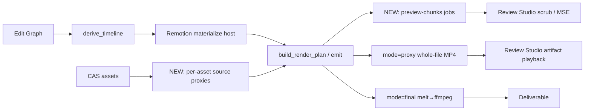
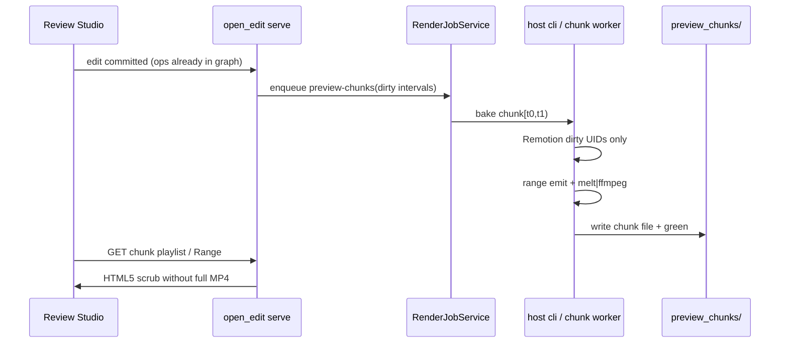

# Open Edit — Rendering Architecture Proposal (Phase 5 + Phase 6)

> **Status:** Architecture **approved for implementation planning** (AH64 2026-08-03). Implementation code still gated on the written implementation plan.
> **Date:** 2026-08-02 (approved 2026-08-03)  
> **Owner:** Synthesis / Documentation Agent (Agent 5)  
> **Inputs:** Phase 0 ground truth, Phase 1 measurements, Agent 2 compositing/Remotion, Agent 3 industry research, Agent 4 sandbox/IR constraints, master plan v3.  
> **Amendment (AH64):** Remotion must become an **in-pipeline frame engine** (same-pass / on-demand with Open Edit), not an external bake-then-stitch program.
> **Format peer:** `docs/superpowers/plans/2026-08-01-render-pipeline-fix.md` (style only).
> **Session compact:** `docs/superpowers/specs/2026-08-03-session-compact.md`

**STOP (updated):** Implementation plans written. No `open_edit/` product code until AH64 approves [master index](../plans/2026-08-03-open-edit-rendering-implementation.md) for execution.

---

## 1. Executive summary

Open Edit’s “preview” path is not interactive. `mode=proxy` is a **full-timeline melt→ffmpeg MP4 encode** at a cheaper profile; Review Studio plays that file in HTML5 `<video>` ([Phase 0](2026-08-02-render-ground-truth.md) § What’s actually true). Kdenlive/Shotcut-class scrubbing requires a **different product surface** (chunked timeline preview cache ± later live consumer), not only a faster whole-file proxy.

**What is slow (Phase 1 cold wall clocks):**

| Fixture | Mode | Wall | Dominant stage |
|---|---|---:|---|
| A (60 s, 0 Remotion) | proxy | **22.8 s** | pipe≈ffmpeg **13.6 s** |
| A | final | **56.9 s** | pipe **41.6 s** |
| B (60 s, 3 α FocusPopup) | proxy | **46.1 s** | Remotion **24.7 s (53%)** |
| B | final | **97.7 s** | Remotion **36.1 s** + pipe **45.9 s** |
| C (180 s, 12 TitleCards) | proxy | **157 s** | Remotion **93.7 s (60%)** |
| C | final | **286 s** | Remotion **111 s** + pipe **133 s** + repair/QC **~26 s** |

Warm identical re-runs already hit the final MP4 `RenderCache` (A/B proxy warm **~5–6 s**, C final warm **~24 s**) — wall then dominated by **QC**, not encode ([Phase 1](2026-08-02-render-phase1-measurements.md) § Cache behavior). Remotion composition cache hits drop rematerialize to **~0.2–0.5 s**, but materialize still runs **before** the MP4 cache check ([Phase 0](2026-08-02-render-ground-truth.md); [Agent 2](2026-08-02-render-compositing-remotion.md) §1).

**Why it feels broken in editing:** any graph change invalidates the whole-file deliverable key → full rematerialize (misses) + full pipe. Editing one overlay still pays N-composition Remotion serial cost (~7.8 s/comp on C proxy) and a full timeline encode.

**Recommended decision (one line):** **Keep** melt→ffmpeg frame-server for **final** and for whole-file **proxy review artifacts**; **heavily modify** Remotion materialize + cache/QC policy; **add** a new host-worker **chunked timeline preview** path for interactive scrub — do **not** replace the compositor stack or put GPU inside the free-form sandbox ([Agent 4](2026-08-02-render-sandbox-ir-constraints.md) §4.1).

---

## 2. Product split: three systems

Industry framing (master plan + [Tier 1 research](2026-08-02-render-industry-research.md) §0) maps to Open Edit as:

| Product system | Purpose | Open Edit today | Target |
|---|---|---|---|
| **A. Interactive / chunked preview** | Scrub/seek while editing; dirty-zone bake | **Missing** — HTML5 plays whole MP4 only ([Phase 0](2026-08-02-render-ground-truth.md)) | Background chunk cache + HTML5 playlist/MSE; audio independent of video chunks ([Kdenlive Timeline Preview](https://docs.kdenlive.org/en/tips_and_tricks/tips_and_tricks/timeline_preview_rendering.html)) |
| **B. Proxy review artifact (`mode=proxy`)** | Shareable low-res full cut for Review Studio / agents | Full-timeline MP4 @ `fast_proxy` 640×360 + quality `fast` ([Phase 0](2026-08-02-render-ground-truth.md)) | Keep as **artifact** path; speed via Remotion dirty/parallel + optional skip QC; **not** the scrub path |
| **C. Final export (`mode=final`)** | Delivery-quality MP4 | Same spine @ 1080p30 + `standard` + NVENC when available | Keep melt→ffmpeg; Remotion reuse; repair/QC policy; no greenfield compositor |

**Also name separately (not a mode):** **per-asset source proxies** — low-res CAS stand-ins for heavy camera media ([Kdenlive Proxy Settings](https://docs.kdenlive.org/en/project_and_asset_management/project_settings/proxy_settings.html), [Shotcut Proxy Editing](https://forum.shotcut.org/t/settings-proxy-editing/18517)). Today `mode=proxy` is **not** this ([Phase 0](2026-08-02-render-ground-truth.md) explicit statement).



---

## 3. Decision: keep / modify / replace current renderer

| Layer | Verdict | Trace |
|---|---|---|
| melt→ffmpeg frame-server (`f=rawvideo` pipe) | **Keep** for proxy artifact + final | Phase 0 spine; 2026-08-01 fix must not regress ([Hard Constraints](../plans/open-edit-rendering-optimization-plan.md)); Phase 1 A shows pipe is real work without Remotion but not the overlay-tax |
| Remotion materialize → CAS → ffmpeg overlays | **Heavily modify** (dirty-only orchestration, parallel miss path, alpha/disk policy, skip-on-deliverable-hit, eviction) | Phase 1 B/C: Remotion **53–60%** of proxy cold wall; Agent 2 cost drivers |
| Whole-file `mode=proxy` | **Keep** as review artifact; **do not** treat as interactive preview | Phase 0: same `render_project` path; Review Studio `<video>` |
| Interactive scrub | **Add** (new path) — chunked host bake + HTML5; defer live MLT SDL/OpenGL consumer | Industry Rank 1 ([Agent 3](2026-08-02-render-industry-research.md) §5); Agent 4 §4.1 Allowed |
| HyperFrames `mode=overlay` | **Leave** off hot path; fix `[outv]` only if overlay mode is product-critical | Agent 2 §6: not on proxy/final spine |
| Greenfield Vulkan / zero-copy GPU compositor | **Reject for now** | Phase 1 did **not** prove pipe ceiling under Remotion load; Shotcut FAQ Tier-1 skepticism ([Agent 3](2026-08-02-render-industry-research.md) §2.3, §6.6); Hard Constraints |
| Full replace of MLT stack | **Reject** | Bias in master plan Phase 4; Phase 1 bottlenecks are Remotion serial + full-timeline invalidation + QC, addressable in-stack |

**Summary label:** **Keep final compositor; heavily modify Remotion + cache/QC; partially replace preview product** (add chunked system alongside whole-file proxy).

---

## 4. Recommended architecture

### 4.1 Host-worker invariant (non-negotiable)

```
Free-form IR (bwrap + ops.jsonl)  →  EditGraphStore
                                         │
                                         ▼
                              derive_timeline (host, pure)
                                         │
                    ┌────────────────────┼────────────────────┐
                    ▼                    ▼                    ▼
            Remotion materialize   preview-chunks job   proxy/final job
                 (host)                 (host)              (host CLI)
                    │                    │                    │
                    └──────────► CAS / cache files ◄──────────┘
                                         │
                                         ▼
                              Review Studio / serve (HTML5)
```

All GPU / melt / ffmpeg / Remotion Chromium stays on the **host render worker** ([Phase 0](2026-08-02-render-ground-truth.md) sandbox vs worker; [Agent 4](2026-08-02-render-sandbox-ir-constraints.md) §1). Free-form never gains `/dev/dri` or shared CUDA with the worker.

### 4.2 Data flow by product bucket

| Bucket | Job kind | Inputs | Outputs | Consumer |
|---|---|---|---|---|
| Interactive preview | `preview-chunks` (new) | Range-emitted MLT + Remotion overlays in range | N-frame/N-sec chunk files + status map (red/yellow/green) | Review Studio playlist / MSE; fallback prior chunks or low-res stub |
| Proxy artifact | existing `mode=proxy` | Full graph | Single MP4 under renders/ | Review Studio artifact; agents; share links |
| Final | existing `mode=final` | Full graph + originals (not source proxies) | Single delivery MP4 | Export |
| Source proxies | `generate-asset-proxy` (new, background) | Canonical asset | Low-res CAS sibling + `proxy_hash` metadata | Emission for preview/chunk/proxy-edit profiles only |

### 4.3 Orchestrator changes (conceptual — not implemented)

1. **Split cache keys:** deliverable MP4 key (today) vs Remotion per-comp key (today) vs **preview chunk key** = `(graph_slice_fingerprint, [t0,t1), preview_profile, remotion_uids_in_range)`.
2. **Materialize gate:** if deliverable `RenderCache` would hit → **skip** Remotion materialize entirely (today: always materialize first — Agent 2 §1 / Phase 1 warm still pays 0.2–0.5 s + QC).
3. **Dirty set:** graph diff → affected time ranges + Remotion UIDs → enqueue only those chunk jobs + rematerialize only those UIDs.
4. **Audio independence:** video chunk invalidation ignores mute/gain/silence ops that do not change video producers ([Kdenlive](https://docs.kdenlive.org/en/tips_and_tricks/tips_and_tricks/timeline_preview_rendering.html); Agent 3 Rank 2).

### 4.4 Constraints checklist (every recommendation)

| Recommendation | Runs in | IPC | GPU | IR path touched | Product bucket | Py 3.11 | Disk | Pipe |
|---|---|---|---|---|---|---|---|---|
| Dirty Remotion + skip-on-MP4-hit | host worker | host files | host Remotion/none | `materialize_*`, orchestrator order | proxy + final + preview | floor OK | eviction required | preserve |
| Parallel Remotion (capped) | host worker | host files | host Chromium | `materialize.py` loop | proxy + final | floor OK | same | preserve |
| Proxy alpha codec policy | host worker | host files | none | `renderer.resolve_alpha_mode` | proxy / preview | floor OK | reduces ProRes | preserve |
| Chunked preview jobs | host worker | host files | host NVENC optional | sidecar schema; range `emit` / plan; `RenderJobService` | **interactive** | floor OK | hard caps | preserve for chunk pipe |
| HTML5 chunk scrub | serve/UI | host files / HTTP Range | none | none (serve) | interactive | N/A | N/A | N/A |
| Per-asset source proxies | host worker | host files | host encode | `Asset` sidecar; `resolve_asset_paths` | source proxies | floor OK | cap derivatives | preserve |
| Skip/async QC on proxy | host worker | host files | none | `RenderJobService._attach_qc` | proxy artifact | floor OK | N/A | preserve |
| Live MLT consumer | host daemon (later) | new host protocol | host GL | emit snapshot | interactive | floor OK | N/A | separate | 
| GPU inside free-form | — | — | — | **REJECT** | — | — | — | — |

---

## 5. Remotion strategy

Grounded in Agent 2 + Phase 1.

### 5.1 Dirty rematerialize

- **Today:** per-comp `composition_cache_key` already hits/misses correctly; miss path is **serial** (~7.8 s/comp C proxy, ~8.2 s/comp B proxy α) ([Phase 1](2026-08-02-render-phase1-measurements.md) § Remotion detail).
- **Gap:** full-timeline MP4 still rebuilds whenever graph hash changes; editing one overlay rematerializes only misses **but** still pays full pipe for whole timeline.
- **Proposal:**
  1. Expose graph-diff → dirty `composition_uid` set (Agent 4 §5.4).
  2. Separate **`force_remotion` / per-UID bust** from `render_project(force=)` (today force only bypasses MP4 cache — Phase 0 / Agent 2 §2).
  3. On deliverable cache hit: **do not enter** materialize loop (saves warm re-ingest; Phase 1 warm Remotion **0.2–0.5 s** is pure waste relative to QC).

### 5.2 Alpha / ProRes cost

- This host: `probe_alpha_capability()=False` → alpha path = **ProRes 4444** ([Phase 1](2026-08-02-render-phase1-measurements.md) § Host).
- B remotion out after proxy+final ≈ **104 MiB** vs C opaque ≈ **8 MiB** ([Phase 1](2026-08-02-render-phase1-measurements.md) § Disk).
- **Proposal:** proxy/preview alpha policy prefer VP8/WebM when acceptable for review; keep ProRes for final when probe fails; pass `composition.alpha` into `OverlayClip` so opaque cards skip `format=rgba` (Agent 2 §3–5). Measure before locking codec (Agent 2 idea 2).

### 5.3 Parallel materialize

- Intra-comp `--concurrency` exists; **inter-comp is a Python `for` loop** (Agent 2 §3).
- Phase 1: C proxy 12× misses sum **93.2 s** ≈ wall materialize **93.7 s** → little idle; parallel pool with cap (e.g. 2–4) should cut materialize toward `ceil(N/k)×mean` if CPU/RAM allow.
- Remains **host worker only**; no sandbox Chromium.

### 5.4 Cache

- Keep content-addressed `materialize:<id>:<hash>` under `remotion/out/cache`.
- Add **size cap + LRU/TTL eviction** (today: none — Agent 2 §2; disk Hard Constraint).
- Optional: avoid duplicate proxy/final rematerialize when preview intentionally shares resolution with `fast_proxy` (Agent 2 idea 6) — only if product accepts same spatial Remotion for proxy artifact and chunk bake.

---

## 6. Chunked timeline preview design

Inspired by Kdenlive Timeline Preview Rendering ([Tier 1](https://docs.kdenlive.org/en/tips_and_tricks/tips_and_tricks/timeline_preview_rendering.html); Agent 3 §1) adapted to Open Edit’s HTML5 Review Studio ([Phase 0](2026-08-02-render-ground-truth.md): no SDL consumer).

### 6.1 Chunk model

| Property | Proposal | Source |
|---|---|---|
| Chunk duration | Start **1 s @ project fps** (Kdenlive default 25 frames @ 25 fps ≈ 1 s); make configurable | Kdenlive manual `timelinechunks` |
| Bake engine | Host job reuses melt→ffmpeg pipe at preview profile (640×360-class), **range-limited** emit | Agent 4 §5.1 Allowed; Phase 0 pipe |
| Remotion in range | Materialize only comps overlapping `[t0,t1)` | Phase 1 per-comp cost |
| Status UX | red (dirty) → yellow (baking) → green (ready), per chunk | Kdenlive progress bar |
| Audio | Video chunks **silent or video-only**; audio from separate cheap path / prior WAV / live decode of A1 | Kdenlive: audio never invalidates video preview |
| Invalidation | Ops touching video/composites/Remotion in range mark chunks red; silence/gain alone do not | Agent 3 Rank 2 |
| Playback | HTML5: playlist of chunk files, MSE/fMP4, or stitch-on-seek; **fallback** to last whole-file proxy while chunks fill | Agent 3 Rank 5 / §6.5 |
| Live MLT consumer | **Phase later** — host preview daemon only if chunk scrub UX insufficient | Agent 3 §6.1; Agent 4 §4.2 |

### 6.2 Host worker + HTML5 (no sandbox)



### 6.3 IR / emission (Agent 4 §5.1)

- **No new free-form ops** required for v1.
- Sidecar schema: chunk id, `[t0,t1)`, fingerprint, profile, path, status.
- `derive_timeline` unchanged for correctness; add **invalidation map** helper from applied ops → time ranges + Remotion UIDs.
- `emit_timeline` / sibling: **range emit**; `build_render_plan` gains preview-chunk mode (stop being fully mode-agnostic for this path).

---

## 7. Source proxies (per-asset) vs `mode=proxy`

| Term | Meaning | Today | Proposal |
|---|---|---|---|
| **`mode=proxy`** | Output profile / whole-timeline review MP4 | Full encode @ `fast_proxy` ([Phase 0](2026-08-02-render-ground-truth.md)) | Keep name for artifact API; document as **review artifact**, not scrub |
| **Source proxy** | Per-asset low-res stand-in in CAS | **Absent** (`Asset` has no `proxy_hash` — Agent 4 §5.3) | Background generate; `resolve_asset_paths` prefers proxy for preview/chunk/proxy-edit; **final uses originals** |
| **Preview scaling** | Cheaper processing resolution | Effectively via output profile on full encode | Match source-proxy vertical res to chunk/preview profile ([Shotcut](https://forum.shotcut.org/t/difference-between-preview-scaling-and-proxy/34728/10) + [MLT preview scaling](https://www.mltframework.org/docs/previewscaling/)) |

**Important:** Source proxies **do not** fix Remotion overlay wall-clock (Kdenlive: proxies ≠ timeline preview for effects — Agent 3 §1.4). They help decode/scale of heavy camera media on long A-roll.

**UI drift to resolve in implementation (not blocking architecture):** badge “Proxy 720p” vs default `fast_proxy` 640×360 ([Phase 0](2026-08-02-render-ground-truth.md) unknowns); 2026-08-01 plan text said proxy→720p30 while current profiles default 640×360 — **label/profile consistency** is an acceptance item, not a stack replace.

---

## 8. Final export path

**Keep:** `render_project(mode=final)` → Remotion materialize → emit MLT (base only) → melt rawvideo | ffmpeg overlays+NVENC → repair → cache → QC ([Phase 0](2026-08-02-render-ground-truth.md) ordered path).

**What changes (without replacing the pipe):**

| Change | Why (Phase 1) |
|---|---|
| Dirty/parallel Remotion | C final Remotion **111 s** of **286 s** |
| Skip rematerialize when final MP4 cache hits | Warm still runs materialize then QC |
| Pass `composition.alpha` / skip useless rgba | Agent 2 correctness+cost |
| Repair early-out / lighter analysis when unchanged | C final repair **13.2 s** with `changed=false` |
| QC policy: full gate on final; do not block job status (already); optional async attach | C final QC **13.0 s** cold / **10.8 s** warm |
| Source proxies **off** for final producers | Industry: proxies replaced at full render |
| Preserve `f=rawvideo` contract | Hard Constraint; 2026-08-01 fix |

**Do not:** move final into free-form bwrap; chase zero-copy MLT↔ffmpeg as first lever (Shotcut FAQ; Phase 1 Remotion+invalidation dominate editing pain).

---

## 9. Cache / disk policy

Phase 1 host sat **~87–89%** disk; B remotion out **~104 MiB** alpha; C project peak **~998 MiB**; Remotion `node_modules` **~212 MiB** per project tree ([Phase 1](2026-08-02-render-phase1-measurements.md) § Disk). Ops memory: timeline-test ~95% crises (master plan).

### 9.1 Classes and caps (proposal)

| Cache class | Location | Suggested policy |
|---|---|---|
| Final/proxy MP4 `RenderCache` | project render cache | Keep TTL (`OPEN_EDIT_RENDER_CACHE_TTL_SEC`); add **max bytes**; keep newest deliverable per mode |
| Remotion `out/cache` + `out/{proxy,final}` | `.open_edit/remotion/out/` | **Hard max GiB**; LRU by last hit; never evict CAS sources |
| Preview chunks | new `.open_edit/preview_chunks/` | Cap by GiB + max age; purge red leftovers; Kdenlive-style Cache Data wipe |
| Per-asset source proxies | CAS derivatives | Cap count/GiB; regenerate on miss |
| Remotion `node_modules` | per project | Prefer shared template / once-per-machine if product allows (ops concern; not Phase 1 coded) |

### 9.2 Priority under pressure

1. Canonical source CAS  
2. Newest final deliverable (if any)  
3. Newest proxy artifact  
4. Remotion composition cache (hot UIDs)  
5. Green preview chunks  
6. Everything else — evict first  

### 9.3 Product rule

Any new cache **ships with** eviction + size cap + operator wipe — unbounded caches are a Hard Constraint violation ([Agent 4](2026-08-02-render-sandbox-ir-constraints.md) red-flag #10).

---

## 10. Migration phases (checkbox acceptance)

Implementation **forbidden** until AH64 approves. Phases below are the proposed rollout **after** green light. Review Studio keeps whole-file proxy playback until Phase M3 lands.

### Phase M0 — Instrumentation & naming (non-breaking)

- [ ] Stage timers for Remotion / pipe / repair / QC remain available in diagnostics (extend Phase 1 harness into product logs as needed).
- [ ] Docs/UI copy distinguish **review artifact (`mode=proxy`)** vs **source proxy** vs **timeline preview chunks**.
- [ ] Resolve or document 640×360 vs “720p” badge drift.
- [ ] Confirm Chrome/Remotion browser strategy for prod (Phase 1 needed system Chrome bridge).
- [ ] **AC:** No behavior change required; agents/docs use three-system vocabulary.

### Phase M1 — Remotion + cache/QC quick wins (host worker)

- [ ] Skip Remotion materialize when deliverable `RenderCache` hit is known before materialize (reorder orchestrator gate).
- [ ] `force_remotion` / per-UID invalidate ≠ MP4 `force`.
- [ ] Capped parallel Remotion materialize on miss.
- [ ] Wire `composition.alpha` → `OverlayClip`; skip `format=rgba` when false.
- [ ] Proxy-mode alpha codec policy (measure VP8 vs ProRes on fixture B).
- [ ] Remotion `out/` size cap + eviction.
- [ ] Proxy jobs: skip or async QC by default; final keeps QC.
- [ ] Repair: cheap early-out when analysis would be `changed=false` (preserve correctness tests).
- [ ] **AC:** Re-bench fixtures A/B/C; C proxy cold Remotion wall ≤ **~50%** of Phase 1 **93.7 s** under parallel×2+ (or document hardware limit); warm proxy wall **≪ 5 s** when MP4 cache hits (Phase 1 was **5.0–15.4 s** QC-dominated); disk policy refuses unbounded `remotion/out` growth in tests.
- [ ] **AC:** `f=rawvideo` pipe tests still pass; no free-form sandbox changes.

### Phase M2 — Per-asset source proxies

- [ ] `Asset` (or sidecar): `proxy_hash`, profile, status.
- [ ] Background host job generates proxies at preview vertical res.
- [ ] `resolve_asset_paths`: preview/chunk/proxy-edit → proxy; final → original.
- [ ] Eviction for proxy derivatives.
- [ ] **AC:** 4K-class fixture (when available) shows lower pipe decode cost on proxy/chunk vs original; final byte path still original hash; free-form ops still reference canonical hashes.

### Phase M3 — Chunked timeline preview + HTML5 scrub

- [ ] Sidecar chunk schema + dirty interval helper from graph ops.
- [ ] Host `preview-chunks` job: range emit + bake + red/yellow/green.
- [ ] Audio-independent invalidation for silence/gain.
- [ ] Remotion dirty-only for comps overlapping dirty ranges.
- [ ] Review Studio: play green chunks (playlist/MSE); fallback to last proxy artifact; show progress.
- [ ] Chunk cache caps + wipe API.
- [ ] **AC:** Edit **one** Remotion overlay on fixture C → visible scrub update for that zone without waiting for full **157 s** proxy; untouched green zones remain seekable; silence-only edit does not flush video chunks; sandbox still IR-only.

### Phase M4 — Optional live MLT preview daemon

- [ ] Only if M3 scrub UX insufficient.
- [ ] Host-only consumer; dual-profile preview scaling ([MLT](https://www.mltframework.org/docs/previewscaling/)).
- [ ] **AC:** Explicit product decision; Agent 4 checklist green; no bwrap GPU.

### Phase M5 — Final export polish

- [ ] Apply M1 Remotion/repair/QC policies to final.
- [ ] Optional overlay-input tax reductions (concat short overlays) **only if** Phase 1-style rebench shows ffmpeg stage regression with N overlays (Agent 2 idea 4).
- [ ] **AC:** C-like final cold improves vs Phase 1 **286 s** by ≥ Remotion parallel/dirty gains; pipe contract unchanged; QC still available for delivery.

---

## 11. Before/after estimates (Phase 1–grounded)

Estimates assume same host (RTX 4050 laptop class), same fixtures, cold unless noted. **Not** generic industry percentages.

### 11.1 Fixture C proxy cold (baseline **157 s**; Remotion **94 s**, pipe **43 s**)

| Lever | Remotion | Pipe | Wall estimate | Notes |
|---|---:|---:|---:|---|
| Phase 1 baseline | 94 | 43 | **157** | measured |
| Parallel Remotion k=3 (ideal) | ~31 | 43 | **~80–90** | ~1.8×; CPU contention may land ~100 s |
| Parallel + dirty **1/12** comps after edit | ~8 | 43 | **~55–65** | still full pipe — why chunks matter |
| M3 chunks: dirty ~3 s zone only | ~8 | ~2–5 | **~15–25** to green zone | scrub; not whole-file proxy |
| Warm identical (today) | 0.5 | 0 | **15.4** | QC **1.9 s** + overhead |
| Warm + skip materialize + skip proxy QC | 0 | 0 | **~1–3** | MP4 cache hit path |

### 11.2 Fixture B proxy cold (baseline **46 s**; Remotion **25 s** α ProRes)

| Lever | Estimate |
|---|---|
| Parallel k=3 | Remotion ~9 s → wall **~25–30 s** |
| Cheaper proxy alpha (if VP8 quality OK) | Remotion time + disk ↓ vs **~7 MiB/comp ProRes**; remeasure required before claiming × |
| One dirty comp + chunks | Remotion ~8 s + short chunk ≪ **46 s** full proxy |

### 11.3 Fixture A / final (encode-bound)

| Run | Baseline | After M1 (limited) |
|---|---:|---|
| A proxy cold | **22.8 s** (pipe 13.6) | ~same encode; warm ≪ **5 s** if QC skipped |
| A final cold | **56.9 s** (pipe 41.6) | ~same unless encoder tier changes; repair/QC trim few seconds |
| C final cold | **286 s** (Rem 111 + pipe 133 + R/Q 26) | Remotion ~37 s @ k=3 → wall **~200 s** (~1.4×) before pipe work; chunks **do not** replace final |

### 11.4 Stretch metrics (master plan) — remapped

| Master-plan stretch | Phase 1 reality | Architecture response |
|---|---|---|
| Scrub realtime on cached preview | Not measurable today (no chunk path) | M3 acceptance |
| Edit one overlay → seconds not full re-encode | Today ≈ full C proxy **157 s** or full rematerialize+pipe | Dirty Remotion + chunks |
| ≥2× proxy with N overlays | C proxy **157 s**; 2× ⇒ **~78 s** | Plausible via parallel Remotion alone (~1.8×); **2×+** with dirty+partial pipe or chunks |
| Long ~27 min / ~50 overlays | **Not measured** (timeline-test `.open_edit` missing; C is 180 s/12) | Extrapolate serial Remotion ≈ 50×~8 s ≈ **400 s** materialize alone before pipe — priority = dirty/parallel/chunks; **rebench on restored project before claiming** |

---

## 12. Risks / open questions

| Risk / question | Impact | Mitigation |
|---|---|---|
| Fixture C ≠ timeline-test (missing `.open_edit`) | Underestimates Remotion N and duration | Rebench when project restored; don’t ship “2×” claims on C alone |
| Remotion Chrome bridge not productized | Materialize flaky without headless-shell | Productize Phase 1 `OPEN_EDIT_REMOTION_BIN` pattern |
| Parallel Remotion RAM spike (ProRes α) | OOM / disk thrash on 6 GiB GPU host | Cap concurrency; prefer lighter proxy alpha codec |
| Chunk HTML5 UX (gaps, A/V sync) | Scrub feels worse than whole MP4 | Keep proxy artifact fallback; audio-independent design |
| Alpha probe false → ProRes forever | Disk/decode tax | Proxy-specific policy; improve probe |
| `composition.alpha` default True in overlays | Extra rgba on opaque cards | Wire plan field (Agent 2) |
| HyperFrames `[outv]` bug | Overlay mode wrong | Out of proxy/final critical path; fix if overlay mode used |
| Python policy vs practice (3.11 pin vs 3.14.5 runtime) | CI/sandbox drift | Agent 4 §2: treat 3.11 as floor+mypy; no 3.14-only APIs |
| Live MLT consumer scope creep | Large product change | Defer to M4 |
| Disk at 87%+ | Any cache can brick host | Hard caps before enabling chunks |
| HW decode for scrub | Low ROI per Shotcut | Do not architect around it |

---

## 13. Acceptance criteria summary

| ID | Criterion | Phase | Evidence gate |
|---|---|---|---|
| A1 | Three product systems named in UI/docs; `mode=proxy` ≠ source proxy ≠ chunks | M0 | Doc/UI review |
| A2 | Deliverable cache hit skips Remotion materialize | M1 | Warm wall ≪ Phase 1 warm |
| A3 | Parallel Remotion reduces C proxy Remotion stage vs **93.7 s** | M1 | Rebench JSON |
| A4 | Remotion disk eviction enforced under cap | M1 | Test + `du` |
| A5 | Proxy QC skip/async; final QC retained | M1 | Job policy tests |
| A6 | Source proxies used for preview emit; final originals | M2 | Path resolve tests |
| A7 | Dirty-zone chunk scrub without full timeline MP4 | M3 | Fixture C one-overlay edit |
| A8 | Audio-only edits do not invalidate video chunks | M3 | Invalidation unit tests |
| A9 | Free-form sandbox unchanged (no GPU/IPC break) | all | Agent 4 checklist |
| A10 | `f=rawvideo` pipe contract preserved | all | Existing pipe tests |
| A11 | No `open_edit/` code before AH64 approval of the **implementation plan(s)** | gate | Process (architecture approved for planning 2026-08-03) |

---

## 14. Hard Constraints broken?

**None** — for the recommended path (M0–M3 + keep final pipe).

All primary recommendations are Agent 4 **Allowed** on the host render worker / serve-UI:

- Dirty/parallel Remotion, chunked preview, HTML5 scrub over files, per-asset source proxies, QC policy, disk eviction.

**Explicitly not proposed** (would require “breaks X”):

- melt/ffmpeg/Remotion inside free-form bwrap  
- Shared CUDA/GL/dmabuf across sandbox boundary  
- Replace `ops.jsonl` with sockets/shm for IR  
- Default `/dev/dri` in free-form sandbox  
- Greenfield Vulkan compositor as prerequisite  
- 3.14-only APIs without runtime matrix note  

**Policy note (not a break if handled):** Python “3.11 strict pin” in the master plan vs packaging `>=3.11` and runtime **3.14.5** ([Phase 0](2026-08-02-render-ground-truth.md); [Agent 4](2026-08-02-render-sandbox-ir-constraints.md) §2). Architecture requires **language floor 3.11 + mypy 3.11**; any newer-syntax dependency must call out a runtime matrix — that is documentation honesty, not an intentional Hard Constraint break.

---

## 15. Contradictions between agent docs (and resolutions)

| # | Contradiction | Resolution for this proposal |
|---|---|---|
| 1 | Master plan execution gate still says Phases 0–6 “Not started” / waiting Phase 0 green light; Phase 0–4 docs exist dated 2026-08-02 | **Resolved as process drift:** treat Phase 0–4 deliverables as complete inputs; this file **is** Phase 6. Update master plan pointer (below) to Waiting AH64 on **architecture**, not Phase 0. |
| 2 | Master plan “Python 3.11 strict pin” vs Phase 0/Agent 4 runtime 3.14.5 and `requires-python>=3.11` | **Resolved:** 3.11 = supported floor + mypy; do not claim exclusive 3.11-only runtime. |
| 3 | 2026-08-01 fix plan: proxy → **720p30**; Phase 0 profiles: default **`fast_proxy` 640×360**; UI badge “Proxy 720p” | **Resolved:** architecture uses **actual Phase 0 profile** (640×360) for estimates; M0 must reconcile label/profile. Do not assume 720p in speed claims. |
| 4 | Master plan success table cites ~10 min / ~27 min timeline-test-like loads; Phase 1 used **180 s / 12** overlays because timeline-test `.open_edit` missing | **Resolved:** all numeric claims cite Phase 1 fixtures; long-form targets marked **extrapolated / rebench required**. |
| 5 | Agent 3 §11: “Phase 1 measurements still required” (written pre-Phase 1) | **Resolved:** Phase 1 doc + `phase1-raw/*.json` now authoritative for numbers. |
| 6 | Phase 1 `melt` diagnostic ≈ 0 s vs intuition that melt is heavy | **Resolved:** metric is residual after concurrent ffmpeg; **pipe wall ≈ ffmpeg stage** (Phase 1 method). Architecture never optimizes “melt=0”. |
| 7 | Agent 2: materialize always before MP4 cache; Phase 1 warm Remotion 0.2–0.5 s with composition hits **and** MP4 hit | **Resolved:** both true — composition cache works, but orchestrator order still wastes work; M1 reorders/skips. |
| 8 | Industry Rank 1 prefers MLT overlay track consumer; Open Edit Review Studio is HTML5-only | **Resolved:** bake chunks with MLT/ffmpeg on host; **play** via HTML5 (Agent 3 Rank 5 adaptation); live MLT deferred to M4. |
| 9 | Agent 2 HyperFrames `[outv]` bug vs “proxy/final Remotion dwarfs HyperFrames” | **Resolved:** do not block architecture on HyperFrames; track as separate overlay-mode bug. |

---

## 16. STOP — implementation gate

```
╔══════════════════════════════════════════════════════════════╗
║  ARCHITECTURE: APPROVED FOR PLANNING (2026-08-03)             ║
║  PRODUCT CODE: STILL FORBIDDEN                                ║
║  No open_edit/ code / job wiring until AH64 approves the      ║
║  written implementation plan(s) under docs/superpowers/plans/ ║
║                                                              ║
║  Orchestra: Grok + GPT Luna 5.6 planning subagents            ║
║  First execution after plan approval: M0/M1 only              ║
╚══════════════════════════════════════════════════════════════╝
```

**Handoff:** Plans complete — see [master index](../plans/2026-08-03-open-edit-rendering-implementation.md). Approve execution (recommend M0/M1 first) to unlock code.

### Reference index

| Doc | Role |
|---|---|
| [Master plan v3](../plans/open-edit-rendering-optimization-plan.md) | Investigation charter + Hard Constraints |
| [Phase 0 ground truth](2026-08-02-render-ground-truth.md) | Code-backed spine |
| [Phase 1 measurements](2026-08-02-render-phase1-measurements.md) | Wall/stage numbers |
| [Agent 2 Remotion/compositing](2026-08-02-render-compositing-remotion.md) | Cache/alpha/overlay drivers |
| [Agent 3 industry](2026-08-02-render-industry-research.md) | Tier 1 patterns |
| [Agent 4 sandbox/IR](2026-08-02-render-sandbox-ir-constraints.md) | Allowed vs break |
| [2026-08-01 render pipeline fix](../plans/2026-08-01-render-pipeline-fix.md) | Baseline frame-server (format peer) |
